# “医”心医意——智能中医传承创新辅助平台
[**中文**](./README.md)|

     
    
     

    
    

**“医”心医意—智能中医传承创新辅助平台**解决了在目前的中医传承中存在两大问题。针对已有的中医传承平台无法覆盖全面的多模态数据这一挑战，我们构建了更全面的[中西医知识图谱](https://github.com/ywjawmw/TCM_KG)。其次，针对中医经验传承效率低这一挑战，我们提出了可解释的药方分析技术来挖掘处方信息，自动分析从症状到中药这一立体诊疗过程并给出分析的科学依据。同时提供了一个公平的辅助平台，让青年医师、中医学生等人群快速掌握先进的中医知识，传承经验。

- 🚀 平台以辨证论治理论为核心，将上万条中医药知识和诊疗信息建立成一套集症状、证候、治法、处方医案于一体的在线解决方案，打造了一个多维多模态数据平台，最终实现了平台的数据分析、中药推荐、药理分析、核心方分析、证候推断、智能中医知识问询和查询7大功能。致力于让中医学生、科研人员、基层或初级医师的背后，都有一位资深博学的名中医在指导辅助指导辅助学习和诊疗决策。

- 🚀 我们的产品主要面向中医药学校等教育机构和中医院等医疗机构。在教育机构中，我们的产品可以提供多种学习方式，帮助中医药专业的学生提高其学习效率，从而可以加速教育机构人才培育的效率。同时通过高效的中医知识检索、通览、分析以及智能化地生成诊疗方案，青年研究人员可以利用我们的产品进行科学研究，促进其科研成果的产出，进一步帮助教育机构以及医疗机构掌握自主的中医药知识产权。同时通过智能诊疗方案的推荐、医案的高效管理，辅助基层或初级从业医师快速提升其专业能力，加速基础医疗机构临床人才的培育，进而可以帮助各个地区的医疗资源均衡发展。

- 🚀 通过与基于中医传承计算平台V3.0和悬壶台中医辅助诊疗平台等同类已有平台相比较，我们的产品高效并支持各种类型的数据接入，提供智能诊疗方案的同时解释方案中的中医原理并提供可解释的药理分析。我们的功能全面，支持多种学习方式，可以直接接入已有平台实现落地使用。
  
**平台技术框架**

     
    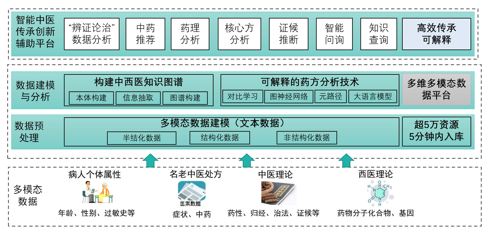
     

**平台页面展示**
- 🚀 功能1：中药推荐（辅助开药）
  
①点击处方管理模块中的“处方总览”按钮，点击右上方的“＋”号创建新的处方，如图2-2-3所示；

②输入处方名称、描述、开方时间、症状等信息，选择参考的数据来源和AI算法，点击确定；

③浏览下方表格即可以通览与输入症状相关的经典方，点击编辑药方，点击提交处方后可以生成一个基于经典方的处方;

④表格下方左列的推荐的10味中药即为参考的药方，同时可以查看每味中药的功效和图片，添加或删除中药，同时可以输入相应的剂量。

  

     
    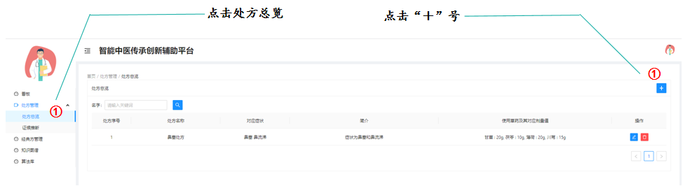
     
     
    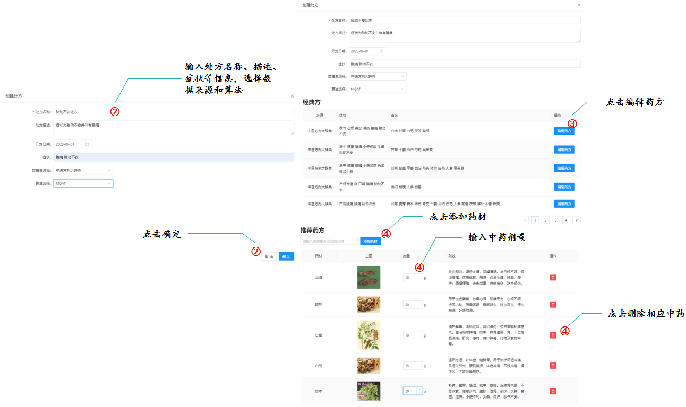
     
     
    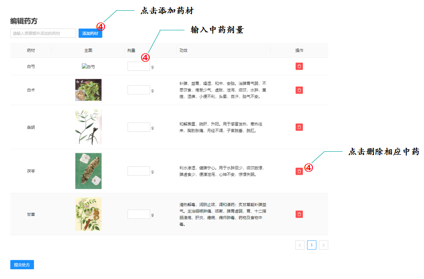
     
  

  
- 🚀 功能2：药理分析（提供可解释的方药科学理论依据）
  
⑤点击表格内任意一味中药所在行；

⑥浏览在页面最下方出现的中药的化合物分析以及对应的可解释路径，提供提解释的方药科学理论依据，可作为中药单体筛查的可解释依据。
  

     
    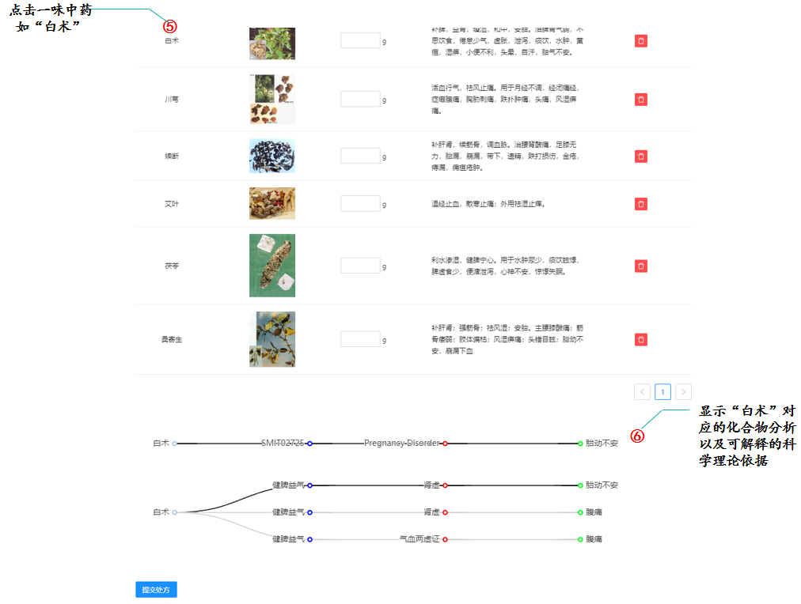
     
  

  
- 🚀 功能3：“辨证论治”数据分析（提可解释的临床诊疗思维过程）

⑤同样点击表格内任意一味中药所在行；

⑦浏览该中药下方出现的中医开药解释路径。默认组内多条路径中加粗的一条为最终解释，其余仅供参考。

  

     
    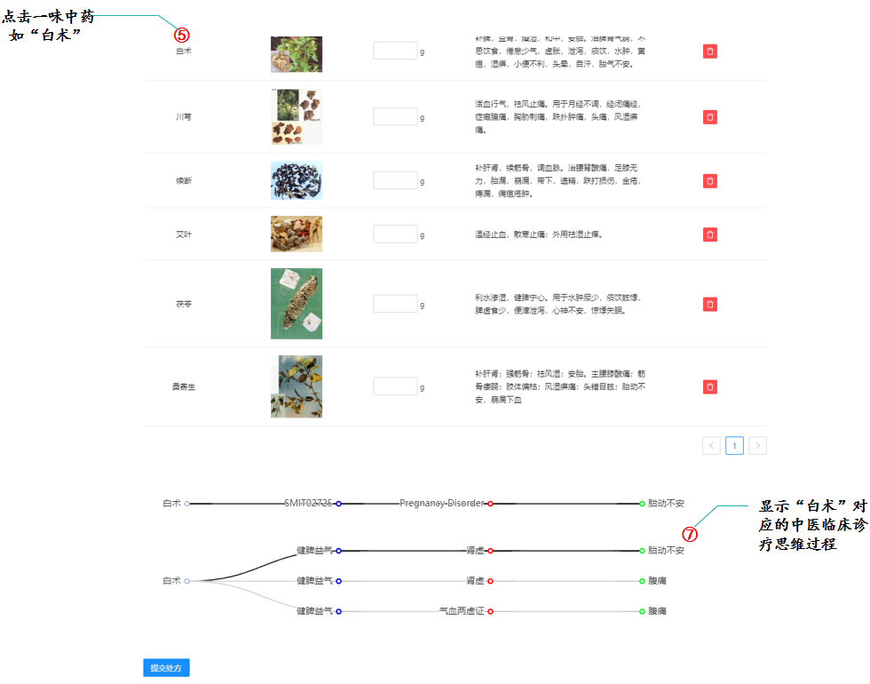
     
  

- 🚀 功能4：核心方分析（生成处方）

⑧点击“提交处方”按钮，生成新的处方；

⑨等待页面跳转，可以查看、编辑或删除生成的处方笺；

  

     
    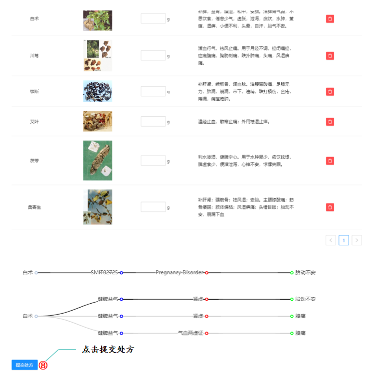
     
     
    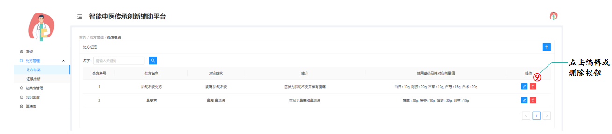
     
  

- 🚀 功能5：证候推断

⑩点击侧边栏“证候推断”；

⑪输入药方中的中药；

⑫点击蓝色的查询按钮;

⑬显示该药方对应的证候;

⑭在下方显示每个中药在推断证候时的贡献值，颜色越深表示贡献越大。

  

     
    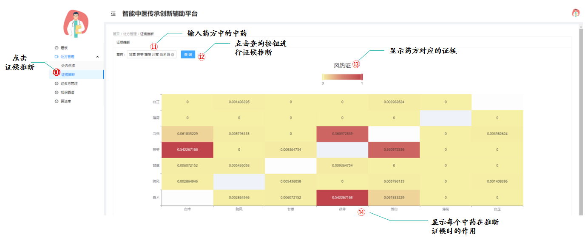
     
  

- 🚀 功能6：中医药知识智能问询[基于“神农”中医药大模型](https://github.com/michael-wzhu/ShenNong-TCM-LLM)

在侧边栏点击“智能问询”，右侧为我们构建的“扁鹊”中医药大模型介绍。点击“扁鹊—中医药大模型”即可跳转到“神农”大模型（原“扁鹊”中医药大模型）问询界面。在输入栏中输入要问询的内容，使用换行键进行问询操作。

  

     
    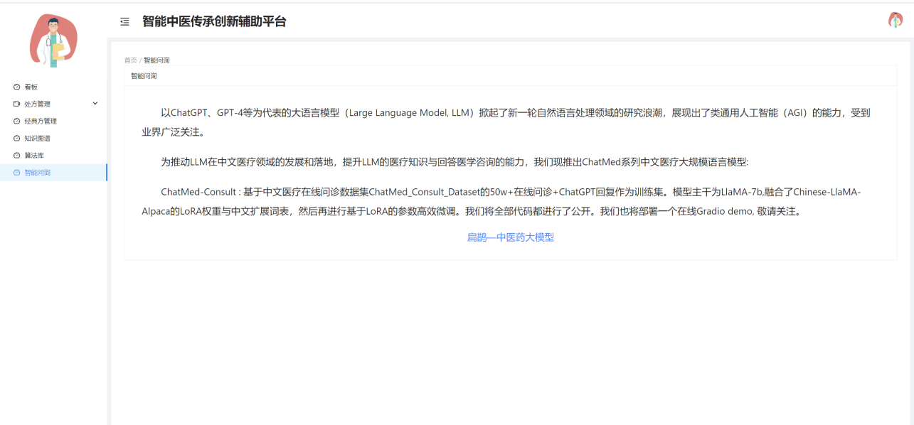
           
     
    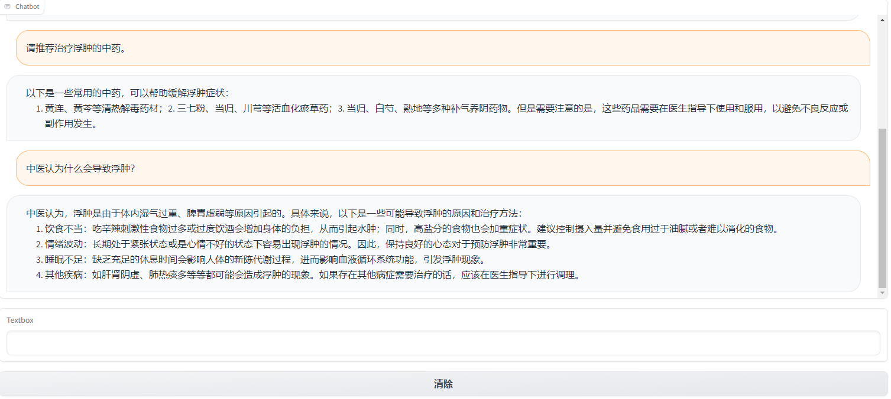
     
  

- 🚀 功能7：智能知识查询功能

我们的系统还提供了两类智能知识查询功能：

1）利用知识图谱进行智能知识查询。点击知识图谱按钮后，可以自主查询要了解的知识，点击搜索按钮在下方会显示与该知识相关的中医实体。

  

     
    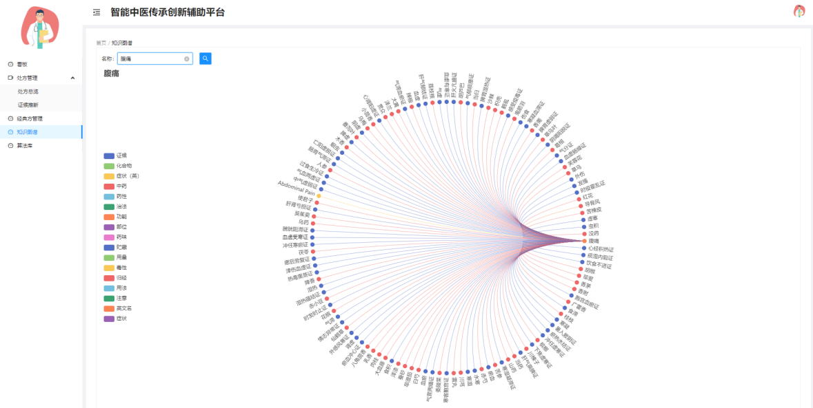
     
  

  
  点击左侧不同颜色的按钮可以隐藏该类实体信息：
  

     
    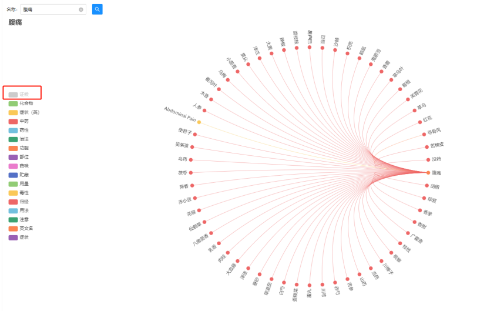
     
  

  
  
2）利用中医知识数据库智能查询经典方。点击“经典方管理”按钮后，可以自主查询要了解治疗某些症状的经典方。选择数据源后，可以输入相应的症状；若不输入内容，则默认显该数据源内所有的经典方。点击搜索按钮，在下方会显示与输入的症状相关的经典方。

  

     
    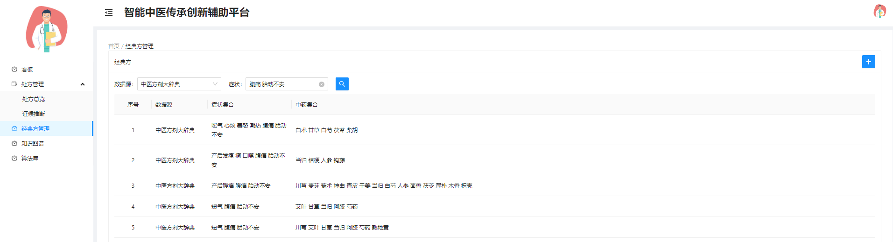
     
  

